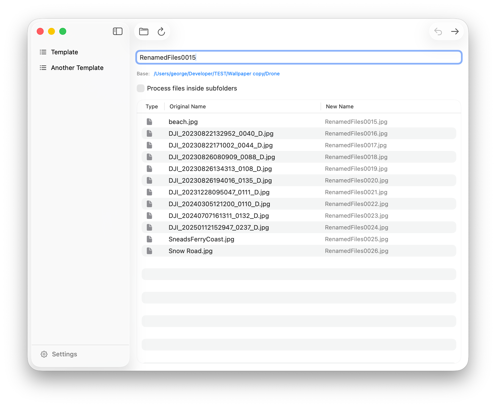

# ✨ Simple Renamer

Tired of files called `IMG_1234.JPG`, `IMG_1235.JPG`, and `IMG_FINAL_FINAL2.JPG`?  
Say hello to **Simple Renamer** – the friendly little macOS app that makes batch renaming painless, fast, and easy.


<p align="center">
  <!-- Add screenshots later -->
  
</p>


---

## 🚀 Features

- 🖱️ **Drag & Drop** – Drop in a folder of files and watch them line up for renaming.  
- 🔍 **Live Preview** – See exactly how files will look before you commit.  
- 📝 **Templates** – Build your own patterns (`Holiday-###`, `Project_[date]`, etc.).  
- 📤 **JSON Support** - Export & Import templates with JSON.
- 🔢 **Counters & Sequences** – Auto-number files like a pro. Automatic or manual padding & automatic / manual sequence starts. 
- 🔄 **Find & Replace** – Fix typos or swap out words across a batch.  
- 💻 **SwiftUI Native** – Lightweight, modern, and built for macOS.  

---

## 🎮 How to Use

1. Launch **Simple Renamer**.  
2. Open (or drag) your files (or folders) into the window.  
3. Preview the new names instantly.  
4. Process! ✅ 

---

## ⚠️ Usage Notes 

I designed this app to rename individual files inside of folders, or files that are nested in subfolders. 

It will **not** accept folders that contain files & folders. 

---

## 🏗️ Tech Stack

- Built in **Swift 6** + **SwiftUI**  
- Clean **MVVM architecture** (`ViewModel.swift` in action)  
- Uses **AppStorage** for your favorite templates  
- macOS **Tahoe ready** 🍎  fancy icon! 

---

## 🖥️ Minimum Requirements

- macOS 15.0 or later  
- Apple Silicon or Intel Mac (not tested on Intel)
- ~20 MB free disk space  

---

## ⚙️ Installation

Download from Releases. It's signed & notarized!

---

## ⚙️ Build it yourself!

Clone the repo and build with Xcode:

```bash
git clone https://github.com/gbabichev/simple-renamer.git
cd simple-renamer
open SimpleRenamer.xcodeproj
```