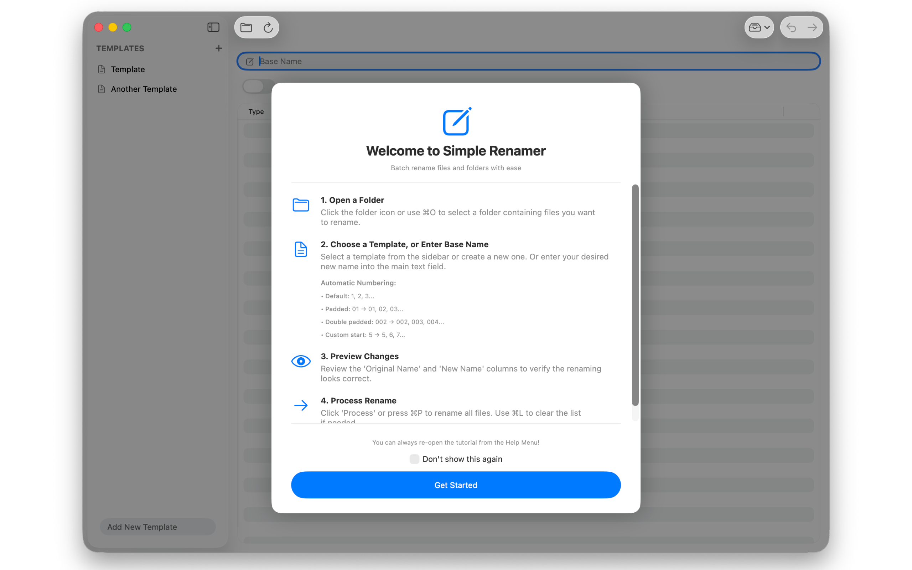
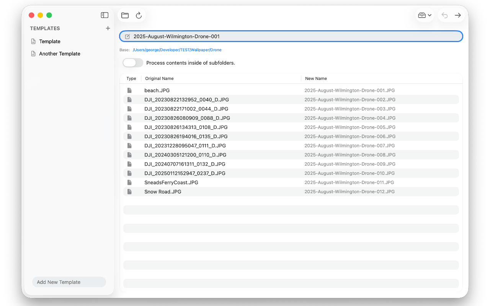

<div align="center">

<picture>
  <source srcset="Documentation/icon-dark.png" media="(prefers-color-scheme: dark)">
  <source srcset="Documentation/icon-light.png" media="(prefers-color-scheme: light)">
  
</picture>
<br/><br/>

Say hello to <b>Simple Renamer</b> – the friendly Mac app that makes batch renaming painless, fast, and easy.

</div>

## 🖥️ Screenshots 

<p align="center">
  
  
</p>

## Features

- 🖱️ **Drag & Drop** – Drop in a folder of files.
- 🔍 **Live Preview** – See exactly how files will look before you commit.  
- 📝 **Templates** – Build your own patterns (`Holiday-###`, `Project_[date]`, etc.).  
- 📤 **JSON Support** - Export & Import templates with JSON.
- 🔢 **Counters & Sequences** – Auto-number files like a pro. Automatic or manual padding & automatic / manual sequence starts. 
- 🔄 **Find & Replace** – Fix typos or swap out words across a batch.  

## How to Use

1. Launch **Simple Renamer**.  
2. Open (or drag) your files (or folders) into the window.  
3. Preview the new names instantly.  
4. Process! ✅ 

## Automatic Numbering
Simple Renamer will automatically append numbers to your files. For Example:
<br>
"Test" will produce Test1, Test2, Test3, etc.
<br>
"Test2" will produce Test2, Test3, Test4, etc. 
<br>
"Test01" will produce Test01, Test02, Test03. etc.
<br>
"Test001" will produce Test001, Test002, Test003, etc. 

## ⚠️ Usage Notes 

I designed this app to rename individual files inside of folders, or files that are nested in subfolders. 

It will **not** accept folders that contain files & folders. 


## 🖥️ Minimum Requirements

- macOS 15.0 or later  
- Apple Silicon or Intel Mac (not tested on Intel)
- ~20 MB free disk space  

---

## ⚙️ Installation

<a href="https://apps.apple.com/us/app/simple-renamer/id6753720459">Mac App Store</a>

Download from Releases. It's signed & notarized!

---

## ⚙️ Build it yourself!

Clone the repo and build with Xcode:

```bash
git clone https://github.com/gbabichev/simple-renamer.git
cd simple-renamer
open SimpleRenamer.xcodeproj
```

## 📝 Changelog

### 1.0.6
- Added tutorial that opens on first app launch, and is available in the Menu Bar.

### 1.0.5
- Updated "Add Templates" logic. 

### 1.0.4
- Added small UI popup when a batch rename is done. 

### 1.0.3 
- Adjusted logic in "Create templates from subfolders" to only look at what's in the table, and not walk the filesystem. 

### 1.0.2
- Added "Create templates from subfolders" option in the Import/Export menu. 

### 1.0.1
- UI Updates for Liquid Glass

### 1.0
- Initial release.

## Privacy
<a href="Documentation/PrivacyPolicy.html">Privacy Policy</a>

## Support 
<a href="Documentation/Support.html">Support</a>